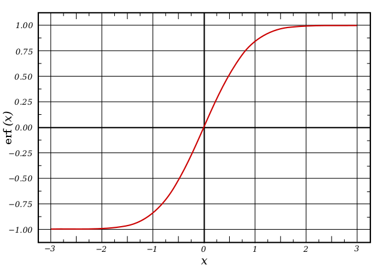
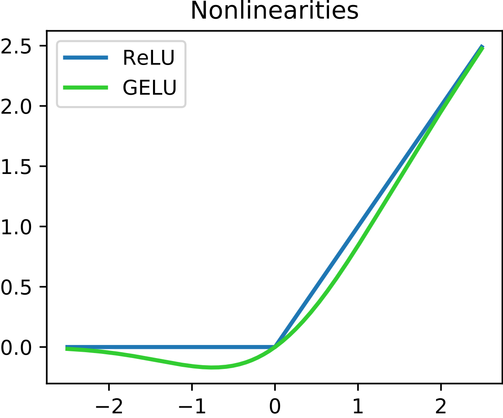

# Activate Function

## Sigmoid

$$
{\sigma(x)={\frac{1}{1+e^{-x}}}={\frac {e^{x}}{1+e^{x}}}=1-\sigma(-x)}
$$

## Tanh

## ReLU

$$
{f(x)=x^{+}=\max(0,x)={\frac {x+|x|}{2}}={\begin{cases}x&{\text{if }}x>0,\\0&{\text{otherwise}},\end{cases}}}
$$

## Leaky ReLU

## ELU

## PReLU（Parametric ReLU）

## Softmax

$$
{\sigma(\mathbf{z})_{i}={\frac{e^{z_{i}}}{\sum_{j=1}^{K}e^{z_{j}}}}\ \ {\text{ for }}i=1,\dotsc ,K{\text{ and }}\mathbf {z} =(z_{1},\dotsc ,z_{K})\in \mathbb {R} ^{K}}
$$

## Swish

## Maxout

## Softplus

# 参考资料

